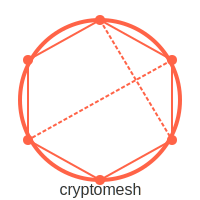

# CryptoMesh 

<p align="center">

</p>
<div align=center>
<a href="https://test.pypi.org/project/mictlanx/"></a>
</div>
Crypto Mesh is a platform engineered to build secure service meshes specifically tailored for machine learning applications. By leveraging advanced cryptographic protocols alongside a robust, distributed mesh architecture, it ensures that data exchanged between machine learning services remains confidential and tamper-proof.

## Getting started

You must install the following software: 

- [Docker](https://github.com/pyenv/pyenv?tab=readme-ov-file#linuxunix)
- Poetry
    ```bash
    pip3 install poetry
    ```
- [pyenv](https://github.com/pyenv/pyenv?tab=readme-ov-file#linuxunix) (Optional)
    ```bash
    curl -fsSL https://pyenv.run | bash
    ```


Once you get all the software, please execute the following command to install the dependencies of the project: 

```bash
poetry install
```
### How to deploy database and broker

**Install docker and docker Compose:**

- Make sure Docker is installed on your system. See [Docker's installation guide](https://docs.docker.com/get-docker/) for instructions.
- Docker Compose is usually included with Docker Desktop. Otherwise, follow [Docker Compose installation instructions](https://docs.docker.com/compose/install/).

**Navigate to your project directory:**

- Open a terminal and change to the directory where your `docker-compose.yml` file is located.

**Start the services:**

- Run the following command to start both services in detached mode:
```bash
docker compose up -d
```

**Stopping the services:**
```bash
docker compose down
```


## Running the CryptoMesh Server with Poetry

Follow these steps to run the CryptoMesh server:

1. **Install Poetry (if not already installed):**
   - Follow the instructions at [Poetry Installation](https://python-poetry.org/docs/#installation).

2. **Install Project Dependencies(If not already installed):**
   - Open your terminal and navigate to the project directory (where your `pyproject.toml` file is located).
   - Run the following command to install all required dependencies:
     ```bash
     poetry install
     ```

3. **Run the Server:**
   - Start the server using Poetry's virtual environment with this command:
     ```bash
     poetry run python3 ./cryptomesh/server.py
     ```
   - This ensures that the server runs with the correct dependencies specified in your project.

4. **Access the API Endpoints:**
   - Once the server is running, you can access the API endpoints in your browser or via a tool like cURL/Postman:
     - `http://localhost:19000/api/v1/services`
     - `http://localhost:19000/api/v1/microservices`
     - `http://localhost:19000/api/v1/functions`

5. **Stopping the Server:**
   - To stop the server, press `Ctrl+C` in the terminal.

**Note:**  
Ensure that any other required services (like MongoDB) are running before starting the server.


## Running Tests

All tests for this project are located in the `tests/` folder at the root of the repository. We use [pytest](https://docs.pytest.org/) as our testing framework.

### How to Run the Tests

1. **Navigate to the project directory:**
   ```bash
   cd path/to/your/project

2. Run all tests:
    ```bash
    pytest
    ```
3. Run a specific test file: 
    ```bash
    pytest tests/test_policy_manager.py
    ```

## Contributing

Please follow these steps to help improve the project:

1. **Fork the Repository:**
   - Click the "Fork" button at the top right of the repository page to create a copy under your GitHub account.

2. **Create a Feature Branch:**
   - Create a new branch from the `main` branch. Use a descriptive branch name (e.g., `feature/new-algorithm` or `bugfix/fix-issue`):
     ```bash
     git checkout -b feature/your-feature-name
     ```

3. **Make Your Changes:**
   - Implement your feature or fix the issue. Make sure to write or update tests located in the `tests/` folder as needed.

4. **Run the Tests:**
   - Verify that all tests pass by running:
     ```bash
     pytest
     ```
   - Ensure that your changes do not break any existing functionality.

5. **Commit and Push:**
   - Write clear and concise commit messages. Then push your branch to your fork:
     ```bash
     git push origin feature/your-feature-name
     ```

6. **Open a Pull Request:**
   - Navigate to the repository on GitHub and open a pull request against the `main` branch. Please include a detailed description of your changes and the motivation behind them.

7. **Review Process:**
   - Your pull request will be reviewed by the maintainers. Feedback and further changes may be requested.
